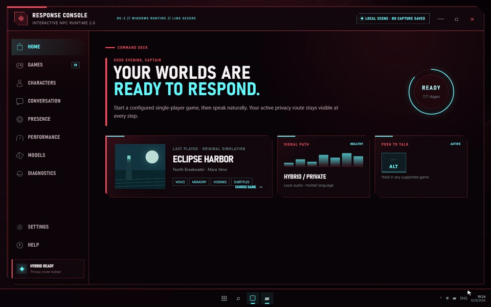

# Interactive LLM Powered NPCs 2.0

> **Major 2.0 rewrite in progress. No public 2.0 installer or release candidate exists yet.**
> This repository is a development preview. Do not download binaries, model packs, or update metadata claiming to be an official 2.0 release. A local release candidate will be produced for review before any public distribution is considered.

Interactive LLM Powered NPCs is a Windows desktop system for natural, game-aware conversations with NPCs in supported **single-player** games. It is being rebuilt around a native streaming runtime, explicit privacy controls, declarative game profiles, and user-configured hosted AI APIs.

The 2.0 design preserves the useful ideas from the 1.x prototype—push-to-talk, character lore, memory, distinct voices, background NPCs, and audio-only conversations—but does not preserve the notebook-based runtime. The old notebooks, executable `voice.py` files, Chroma/pickle data, DeepFace demographic inference, SadTalker pipeline, and plaintext API-key workflow are unsupported legacy material and must not be run as 2.0.

## Simulated product demo



This deterministic Gifsmith walkthrough uses the original fictional game **Eclipse Harbor** and character **Mara Venn**. No copyrighted gameplay, performer likeness, microphone recording, provider request, or benchmark result appears in it; its HUD values are explicitly illustrative. [GIF fallback](docs/assets/demo/demo.gif) · [seekable MP4 review](docs/assets/demo/demo.mp4) · [provenance](docs/assets/demo/PROVENANCE.md)

## Current source status

The checkout now contains the Response Console and Tauri shell, its supervised authenticated Rust runtime sidecar, versioned protocol/runtime contracts, SQLite memory, hosted LLM/STT/TTS adapters, optional visual-worker contracts, provider/model catalogs, a production-capable verified Model Manager core, exercised native WGC/WASAPI/DirectComposition paths, 20 validated profiles, deterministic simulation, a safe Windows game-load harness, and a locally smoke-tested debug NSIS package. Developer-supplied Cohere, ElevenLabs, AssemblyAI, and NVIDIA NIM credentials have passed bounded authentication or synthetic smoke tests without entering the repository. NVIDIA evidence currently covers chat, 2048-dimensional embeddings, and stock-voice Magpie HTTP TTS; its streaming ASR and Magpie gRPC audio paths still require live qualification, and hosted reranking was unavailable at the tested routes. It is still not a game-ready public release: cross-process shared-media transport and HDR qualification, generic screen-space lip-sync qualification, live-game certification, a clean Windows 10/11 VM matrix, release signing, and controlled performance benchmarks remain gated work. See [CHANGELOG.md](CHANGELOG.md) and [IMPLEMENTATION_STATUS.md](IMPLEMENTATION_STATUS.md).

## What 2.0 is building

- **Low-latency conversation:** streaming speech recognition, sentence-level LLM output, streaming speech, interruption, and asynchronous memory.
- **API-first conversation:** configure hosted LLM, STT, TTS, and retrieval providers deliberately; the app never switches providers without prior authorization.
- **Game-aware profiles:** declarative lore, characters, detection rules, identity evidence, safety policy, diagnostics, and explicit fallbacks.
- **Game-agnostic integration:** use external Windows capture and a non-injecting overlay, with manual or generic target selection and audio/subtitles as the dependable path. Optional screen-space lip-sync is experimental and never blocks dialogue.
- **A native Windows control plane:** a Tauri 2 + React Response Console backed by a Rust runtime and a C++/WinRT media broker. Continuous audio and video do not pass through the WebView.
- **Privacy by design:** Windows Credential Manager for secrets, webcam perception off by default, local-only/offline modes, content-light logs, and no demographic inference.

## Response Console

The desktop experience uses an original cybernetic visual system informed by the supplied in-game references: translucent wine-black surfaces, coral/crimson structure, cyan selection and live data, large Windows-native condensed typography, and a measured **Response Spine**:

`Listening → Transcribing → Identifying → Remembering → Responding → Voicing → Animating`

In a runtime-backed session these stages follow ordered runtime lifecycle events; deterministic visual-fixture routes label their sample timings as simulated rather than measured. The console source includes Home, Games, Characters, Conversation, Presence, Performance, Models, Diagnostics, Settings, and Help.

## Game support means capabilities, not a logo

A profile is “supported” only for capabilities backed by evidence:

| Level | Meaning |
| --- | --- |
| Conversation | Detect the game, select/name a character, and use push-to-talk with audio/subtitles. |
| Profile-aware | Add authored lore, biographies, personalities, prompts, and per-game detection/troubleshooting without modifying the game. |
| External identity | Use manual selection first, with read-only OCR or screen evidence only when independently qualified. |
| Experimental visual | Generic screen-space mouth animation is available for evaluation and can fall back immediately. |

The 2.0 release-candidate target contains authored profiles for:

1. The Elder Scrolls V: Skyrim Special Edition
2. Cyberpunk 2077
3. Baldur's Gate 3
4. Fallout 4
5. Fallout: New Vegas
6. The Witcher 3: Wild Hunt
7. Starfield
8. Mount & Blade II: Bannerlord
9. Kingdom Come: Deliverance II
10. The Elder Scrolls IV: Oblivion Remastered
11. The Sims 4
12. Stardew Valley
13. Minecraft: Java Edition
14. Divinity: Original Sin 2
15. Mass Effect Legendary Edition
16. Dragon Age: Inquisition
17. Kenshi
18. Red Dead Redemption 2 Story Mode
19. Grand Theft Auto V Story Mode
20. Elden Ring offline

None of these profiles requires a mod, script extender, DLL, hook, or executable adapter. The last three are risk-gated offline profiles: anti-cheat, protected mode, online mode, or an ambiguous shared executable blocks capture/overlay interaction and falls back safely; the project does not bypass protections. Profile content may be complete before external capture, identity, or screen-space visual capabilities are live-game certified. See [Supported games](docs/getting-started/supported-games.md) and the [compatibility matrix](docs/reference/compatibility-matrix.md).

An experimental **Generic Game** profile provides manual character selection, conversation, memory, audio, and subtitles for other capturable single-player games. Reliable identity, world-state access, and screen-space lip-sync are not promised.

## Architecture at a glance

```text
Tauri 2 + React Response Console
              │ control messages only
              ▼
       Rust NPC runtime
 sessions · providers · policy · SQLite
       │          │
       ▼          ▼
C++/WinRT     inference
media broker  workers
WASAPI/WGC    local/cloud
external capture · subtitles · optional masked residual
```

Versioned control envelopes travel over current-user-restricted Windows named pipes, and child processes are supervised. The media and worker contracts reserve shared-memory PCM rings and shared D3D resources, but their final cross-process mapping/synchronization remains an integration gate. Optional visual failures degrade to audio/subtitles instead of ending the conversation. Read the [architecture overview](docs/architecture/overview.md) for the full process and trust boundaries.

## API routes, optional visuals, and privacy

| Configuration | Typical placement | Network behavior |
| --- | --- | --- |
| API-powered | STT, LLM, TTS, and optional hosted retrieval use explicitly configured hosted providers. | Selected audio, transcript, context, retrieval text, and response data may leave the PC under those providers' policies. |
| API + optional local lip-sync | Conversation still uses configured APIs; a user-selected local pack may animate a captured mouth region. | Provider egress is unchanged; visual frames stay local. No lip-sync pack is currently advertised as qualified. |
| Offline | Provider calls and new AI conversation are disabled. | Local configuration, existing memory, diagnostics, and deterministic fixtures remain available without network access. |

No route silently falls back from one provider to another. Presence/webcam features are local, visibly active, optional, and off by default. Lip-sync packs are never bundled or downloaded automatically: an eligible pack must show its exact model, size, VRAM/RAM, license, measured quality, and experimental caveats before the user opts in. See [Choosing a mode](docs/getting-started/choose-a-mode.md) and [Voices, memory, and privacy](docs/guides/voices-memory-and-privacy.md).

Named provider/model **loadouts** can group explicit LLM, STT, TTS, and retrieval choices. They follow global → game → character inheritance, and switching one is always a visible user action. Every saved fallback is `ManualOnly` and `user_authorized`; no catalog entry or loadout creates an automatic route.

## Try providers before upgrading

These are provider-published experimentation paths checked **2026-08-28**. Offers, eligible models, regions, quotas, retention terms, and commercial-use rights can change; follow the linked pricing page before registering. Use one legitimate account and never create extra accounts to evade quotas.

| Provider | Useful here | Published experimentation path | Important limit | Official links |
| --- | --- | --- | --- | --- |
| NVIDIA NIM | Live-smoked LLM and embeddings; experimental stock-voice TTS; ASR qualification pending; rerank unavailable at tested hosted routes | One user-owned NVIDIA Developer API key can cover available preview endpoints, making it a convenient first provider to try | Development preview/prototyping only; not a production or commercial entitlement, not promised permanently unlimited, and subject to model-specific limits and terms; do not send restricted, confidential, sensitive, or personal data | [NIM for Developers](https://developer.nvidia.com/nim) · [Get a key](https://build.nvidia.com/) · [Quickstart](https://docs.api.nvidia.com/nim/docs/api-quickstart) · [Project setup guide](docs/guides/nvidia-nim.md) |
| Cohere | LLM, embeddings, reranking | Free Trial API key | Evaluation-only; currently 1,000 calls/month plus endpoint RPM limits | [Pricing](https://cohere.com/pricing) · [Sign up](https://dashboard.cohere.com/welcome/register) |
| ElevenLabs | TTS, STT, voice agents | Recurring Free plan | Free output is non-commercial and requires attribution; cloning/library API features are limited | [API pricing](https://elevenlabs.io/pricing/api) · [Sign up](https://elevenlabs.io/app/sign-up) |
| AssemblyAI | Realtime and async STT | $50 free transcription credits, no card required | Free streaming connection limits apply; LLM Gateway is excluded | [Pricing](https://www.assemblyai.com/pricing/) · [Sign up](https://www.assemblyai.com/dashboard/signup) |
| Google Gemini API | Multimodal LLM, realtime audio/TTS | Recurring Free tier for eligible models | Model/region limits vary; Google states Free-tier content may improve its products | [Pricing](https://ai.google.dev/gemini-api/docs/pricing) · [Get a key](https://aistudio.google.com/apikey) |
| Groq | LLM, Whisper STT, selected TTS | Recurring rate-limited Free plan | Per-model request/token/day limits; Batch and Flex require paid Developer access | [Rate limits](https://console.groq.com/docs/rate-limits) · [Console](https://console.groq.com/login) |
| Deepgram | STT, TTS, voice agents | One-time $200 credit, no card required | Credit is consumed rather than renewed; Deepgram currently says it does not expire | [Pricing](https://deepgram.com/pricing) · [Sign up](https://console.deepgram.com/signup) |
| Cartesia | Streaming TTS/STT, voice agents | Recurring Free plan with 20,000 monthly model credits | Free concurrency is limited and commercial licensing begins on Pro | [Pricing](https://www.cartesia.ai/pricing) · [Sign up](https://play.cartesia.ai/sign-in/create) |
| Inworld | TTS, STT, LLM routing | $0 On-Demand prototyping allowance | Published allowance is limited; verify current portal terms before a long test | [Pricing](https://inworld.ai/pricing) · [Portal](https://platform.inworld.ai/) |
| OpenAI API | LLM, Realtime, STT, TTS | Current quickstart offers one test API request | No documented recurring general API free tier; continued use requires API billing | [Quickstart](https://platform.openai.com/docs/quickstart/make-your-first-api-request) · [Sign up](https://platform.openai.com/signup) |
| Anthropic API | LLM | No general free API tier | Console usage requires prepaid credits; research credits are application-based | [API payment](https://support.anthropic.com/en/articles/8977456-how-do-i-pay-for-my-api-usage) · [Platform](https://platform.claude.com/) |

Free/trial output is not automatically redistributable or commercially usable. The app records provider and model terms separately from the project’s MIT license.

## Requirements

- **Windows-only product:** Windows 10 version 22H2 or Windows 11, x64. macOS and Linux are not 2.0 product targets; portable modules exist only for deterministic CI.
- A supported single-player game in windowed or borderless mode for external overlays
- Microphone; headphones are strongly recommended for interruption and echo control
- WebView2 Evergreen Runtime for the Response Console
- Sufficient disk/RAM/VRAM only if the user elects to install a future qualified generic lip-sync pack

API-only conversation has no local model-capable GPU requirement. There is no honest universal lip-sync hardware minimum: the running game and an optional visual pack share resources. Recommendations must use **currently available** memory and measured pack evidence, not GPU name alone. See [System requirements](docs/getting-started/requirements.md).

## Installation and development status

There is **no supported end-user installation yet**. The future base installer will be non-admin and will not bundle AI models, Python, CUDA, or FFmpeg. It will not download a model automatically. Do not follow the old notebook/SadTalker setup instructions.

Developers can follow [source setup](docs/development/setup.md). The canonical command surface is `dev.ps1 setup|dev|test|lint|benchmark|package`. Packaging output is local and unsigned unless the build environment is explicitly configured for authorized signing. Nothing in this repository publishes a release.

## Benchmarks

No 2.0 performance number is published yet. Latency and game-impact figures in project planning are **acceptance targets**, not results. Future results must include commit, OS/build, CPU, GPU, VRAM, RAM, driver, power mode, game/scene/settings, model/provider versions, cold versus warm state, sample count, median, p95, errors, and raw machine-readable traces.

See [Performance and benchmarking](docs/guides/performance-and-benchmarking.md). A number without a linked result manifest should be treated as unverified.

## Documentation

- [Getting started](docs/getting-started/installation.md)
- [Frequently asked questions](docs/getting-started/faq.md)
- [Providers and credentials](docs/guides/providers-and-credentials.md)
- [Trying NVIDIA NIM](docs/guides/nvidia-nim.md)
- [Local Model Manager](docs/guides/local-model-manager.md)
- [Game profiles](docs/guides/game-profiles.md)
- [Runtime contracts](docs/reference/runtime-contracts.md)
- [IPC and wire contracts](docs/reference/ipc-contracts.md)
- [Diagnostics](docs/guides/diagnostics.md)
- [Troubleshooting](docs/troubleshooting/README.md)
- [Developer setup](docs/development/setup.md)
- [Security policy](SECURITY.md) and [support policy](SUPPORT.md)

## Contributing and project status

The rewrite is pre-release and interfaces may change. Before contributing, read [CONTRIBUTING.md](CONTRIBUTING.md), [ROADMAP.md](ROADMAP.md), and [the game-content policy](docs/legal/game-content-policy.md). Profiles must be original or properly licensed, declarative, provenance-complete, and safe for offline single-player use. Copied wiki prose, extracted game media, performer imitation, and executable profile scripts are not accepted.

Public releases, installers, update feeds, model catalogs, tags, packages, and hosted demo assets require explicit maintainer approval. See [CHANGELOG.md](CHANGELOG.md) for what is actually present rather than planned.

## License and acknowledgements

Project-owned source code remains available under the [MIT License](LICENSE). Model weights, hosted services, games, fonts, and third-party components retain their own terms; inclusion in documentation is not a grant of rights.

2.0 builds on lessons from the original prototype and the ecosystems around Tauri, React, Rust, Tokio, Protobuf, SQLite, Windows Graphics Capture, WASAPI, hosted AI providers, and generic screen-space animation research. Exact redistributable components and licenses will be recorded in [third-party notices](docs/legal/third-party-notices.md) before a release candidate.

This project is not affiliated with, endorsed by, or sponsored by the publishers or developers of the supported games.
